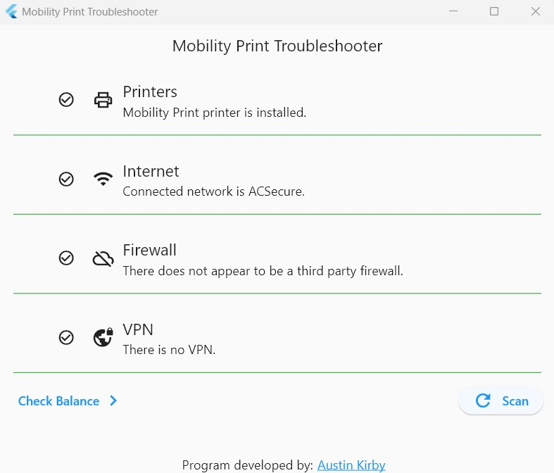

# Mobility Print Troubleshoot

This project is a troubleshooting application designed to help resolve issues with Mobility Print on Windows devices.

## Project Description

The Mobility Print Troubleshoot application aims to simplify the troubleshooting process for printer technicians and the printer support team at Algonquin College. It automates the detection and resolution of common issues encountered while using Mobility Print on Windows devices.

## Features



- **Internet Connection**: Ensure the user is connected to the College internet.
- **Mobility Print Installation**: Verify that Mobility Print is installed on the user's device.
- **Firewall and VPN Check**: Identify if firewalls or VPNs are interfering with Mobility Print usage.

## Installation

To use the Mobility Print Troubleshoot application, follow these steps:

1. Make sure you have Flutter SDK installed on your machine. If not, visit the Flutter website (**[https://flutter.dev](https://flutter.dev)**) and follow the installation instructions for your operating system.
2. Clone the repository to your local machine.
3. Navigate to the project directory in your terminal.
4. Run the following command to fetch the project dependencies:

```
flutter pub get
```

## Usage

To run the Mobility Print Troubleshoot application, execute the following command:

```
flutter run
```

The application will be built and launched on an available connected device or emulator. Follow the on-screen instructions to troubleshoot Mobility Print issues on Windows devices.

## License

This project is licensed under the MIT License.

## Getting Started with Flutter

To get started with Flutter, follow the official Flutter installation guide and setup instructions for your operating system available at **[https://flutter.dev/docs/get-started/install](https://flutter.dev/docs/get-started/install)**.

## Contact

For any inquiries or feedback, please contact Austin Kirby at **[austin@kirbycodes.dev](mailto:austin@kirbycodes.dev)**.

We appreciate your interest and contributions to the Mobility Print Troubleshoot project using Flutter!
